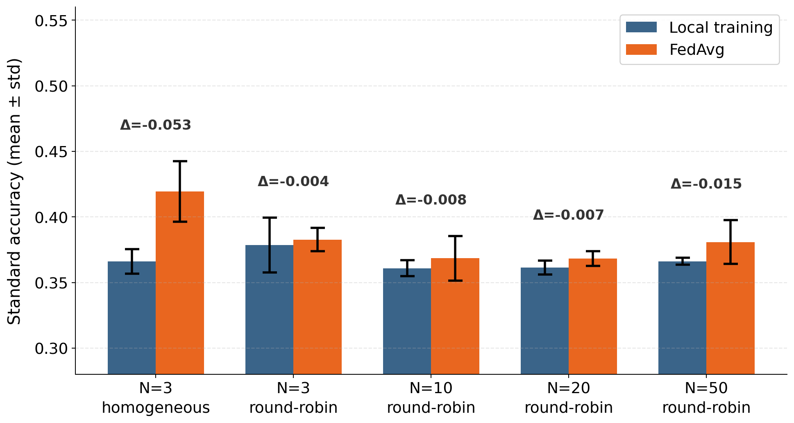

# HeteroSense-FL

[](https://github.com/ss-lab-tut/heterosense-fl-testbed/actions)
[](https://heterosense-fl.readthedocs.io)
[](https://pypi.org/project/heterosense-fl/)
[](https://www.python.org/)
[](LICENSE)

A multimodal sensor simulator for modality-heterogeneous federated learning research.



**Who is it for?**  
Researchers who need reproducible, controllable data for developing and comparing FL algorithms
under *modality heterogeneity* — the condition where different client sites have structurally
incompatible sensor subsets.

**How does it complement Flower and FedML?**  
Flower and FedML orchestrate algorithm execution; they do not generate sensor data.
HeteroSense-FL is the missing data layer: it simulates N indoor sensing sites, each with a
configurable LiDAR / bed-pressure-mat subset, and produces structured 3D point clouds and
16×16 pressure maps for FL research under realistic modality heterogeneity.

**Reusable software assets:**
- `ClientFactory` — configure any N-client modality heterogeneity pattern in one line
- `DatasetBuilder` — deterministic, seeded dataset generation  
- `TemporalWindowSampler` — plug-and-replace interface for temporal encoders
- `run_validation` — automated observation integrity checks (V1–V4)
- `heterosense-benchmark` — one-command Table 3 reproduction (~3 min)

## Scope and limitations

HeteroSense-FL is a **controlled simulation testbed**, not a calibrated digital twin of physical
sensors. Observation models (LiDAR point clouds, bed pressure maps) use researcher-defined
Gaussian priors designed to reflect indoor sensing structure; they are not calibrated to specific
hardware specifications. The software is intended for systematic algorithm comparison under
reproducible, configurable heterogeneity conditions — not for deployment-ready sensor emulation.

## Installation

**From PyPI (recommended for users):**

```bash
pip install heterosense-fl   # Python 3.9+
```

**From source (recommended for reviewers and developers):**

```bash
git clone https://github.com/ss-lab-tut/heterosense-fl-testbed
cd heterosense-fl-testbed

python -m venv .venv
source .venv/bin/activate      # macOS / Linux
# .venv\Scripts\activate       # Windows

pip install -e .
```

## Quick start

```python
from heterosense import ClientFactory, ConfigurationManager as CM
from heterosense import DatasetBuilder, TemporalWindowSampler

# 10-client heterogeneous dataset
clients = ClientFactory.make(10, strategy="round_robin")
data    = DatasetBuilder(CM.from_clients(clients, n_steps=20_000).to_sim_config()).build()

# Temporal window iteration
sampler = TemporalWindowSampler(data["0"], window=3)
for window in sampler:
    z     = TemporalWindowSampler.lidar_z_series(window)   # (3,)
    p     = TemporalWindowSampler.pressure_series(window)  # (3,)
    label = TemporalWindowSampler.center_label(window, sampler.center_idx())
    # replace the two helpers above with your own temporal encoder
```

## Reproducing Table 3 (reference benchmarks)

```bash
heterosense-benchmark
```

Single command. Seeds {42, 123, 7} fixed. Runs in approximately 3 minutes on a
standard laptop (Python 3.10, numpy 1.26, no GPU required).  
Results serve as a reproducible baseline for algorithm comparison and are not a
claim of best-in-class performance.

**Expected output (truncated):**

```
N=3  homogeneous : Local=0.366±0.009  FedAvg=0.419±0.023  Δ=-0.053
N=3  round-robin : Local=0.379±0.021  FedAvg=0.383±0.009  Δ=-0.004
N=10 round-robin : Local=0.361±0.006  FedAvg=0.368±0.017  Δ=-0.008
N=20 round-robin : Local=0.362±0.005  FedAvg=0.368±0.006  Δ=-0.007
N=50 round-robin : Local=0.366±0.003  FedAvg=0.381±0.017  Δ=-0.015
```

## Key components

| Class / function | Description |
|-----------------|-------------|
| `ClientFactory.make(N, strategy)` | N-client modality configuration |
| `ConfigurationManager.from_clients()` | Builds `SimConfig` without manual YAML |
| `DatasetBuilder(sc).build()` | Generates `{client_id: [ModalityBundle]}` |
| `TemporalWindowSampler(bundles, window)` | Sliding-window encoder interface |
| `run_validation(data, modalities)` | Automated integrity checks V1–V4 |

## Modality patterns

| `patterns=` | LiDAR | Pressure mat |
|-------------|-------|--------------|
| `"both"` | ✓ | ✓ |
| `"lidar"` | ✓ | — |
| `"bed"` | — | ✓ |

## Reference benchmarks (Table 3)

Reproduced from `heterosense-benchmark` (seeds {42, 123, 7}; n_steps=3000; 3 FL rounds; TinyMLP):

| N | Pattern | Local std. | FedAvg std. | Local bal. | FedAvg bal. | Δ std |
|---|---------|------------|-------------|------------|-------------|-------|
| 3 | homogeneous | 0.366±0.009 | 0.419±0.023 | 0.252±0.004 | 0.298±0.017 | -0.053 |
| 3 | round-robin | 0.379±0.021 | 0.383±0.009 | 0.285±0.011 | 0.283±0.007 | -0.004 |
| 10 | round-robin | 0.361±0.006 | 0.368±0.017 | 0.280±0.003 | 0.287±0.014 | -0.008 |
| 20 | round-robin | 0.362±0.005 | 0.368±0.006 | 0.282±0.004 | 0.299±0.012 | -0.007 |
| 50 | round-robin | 0.366±0.003 | 0.381±0.017 | 0.277±0.003 | 0.300±0.015 | -0.015 |

std. = standard accuracy; bal. = balanced accuracy (corrects for ABSENT-class dominance).  
Reproduced with: Python 3.10, numpy 1.26 (seeds {42,123,7} fixed).  
FedAvg outperforms Local under balanced accuracy in most conditions.

## Interactive notebook

An annotated quickstart notebook is available in `examples/quickstart.ipynb`:

```bash
pip install jupyter
jupyter notebook examples/quickstart.ipynb
```

## Running tests

```bash
pip install -e ".[dev]"
pytest tests/ -v
```

37 automated tests · Python 3.9, 3.10, 3.11, 3.12 · Linux, macOS, Windows · CI via GitHub Actions

## Documentation

Full documentation: https://heterosense-fl.readthedocs.io

Design tutorial: [docs/tutorial.md](docs/tutorial.md)

## Citation

```bibtex
@software{shao2026heterosensefl,
  title   = {{HeteroSense-FL: A Multimodal Simulation Testbed for
             Modality-Heterogeneous Federated Learning}},
  author  = {Shao, Xun and Yamakawa, Kohsuke and Otani, Aoba},
  year    = {2026},
  doi     = {10.5281/zenodo.19326703},
  url     = {https://zenodo.org/records/19326703},
}
```

## License

MIT — see [LICENSE](LICENSE).
